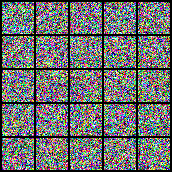

# Implementation of Diffusion Transformer for Rectified Flow-based Image Generation

for my learning purposes

implements
- Diffusion Transformer (DiT)
- RoPE
- Rectified Flow training and sampling

## Results

MNIST:

CIFAR-10:

## References

- Flow Straight and Fast: Learning to Generate and Transfer Data with Rectified Flow
- Step-by-Step Diffusion: An Elementary Tutorial
- Scaling Rectified Flow Transformers for High-Resolution Image Synthesis
